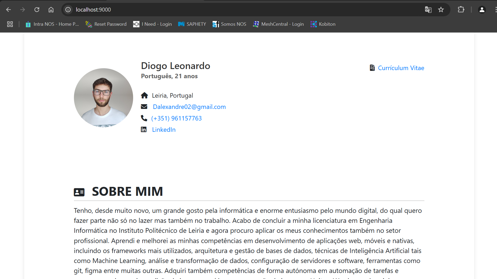
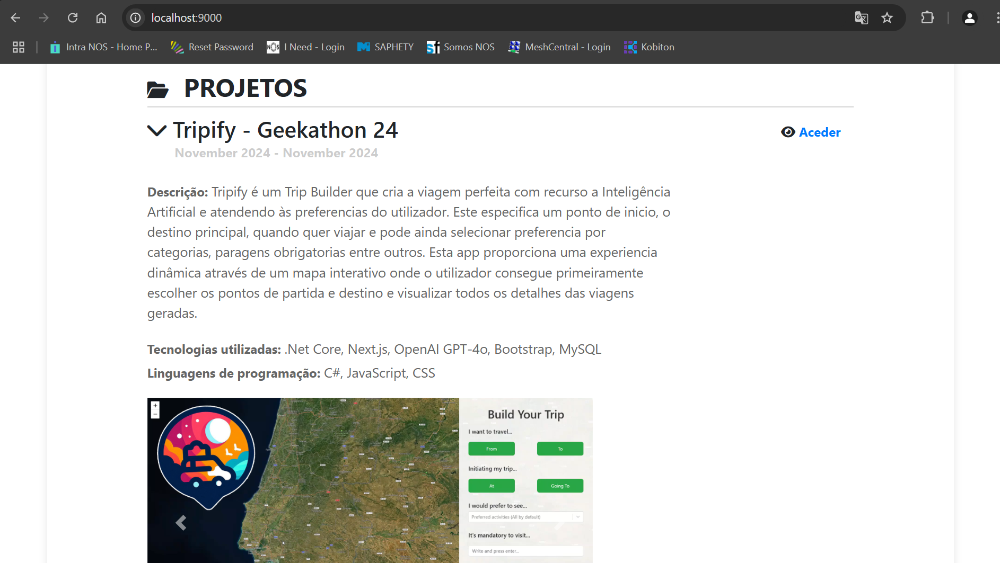

# docker-exercises

Este repositorio destina-se à entrega dos exercicios propostos no ambito da formação de docker.
Neste projeto é apresentado um E-Portfolio com as minhas experiencias e projetos pessoais. Desenvolvido maioritariamente em PHP, usando a framework laravel para o Backend e blade para o Frontend.

Quando executado sem erros, o docker-compose (docker-compose up --build -d) deverá fazer o deploy com sucesso da web app e respetiva bd, sendo acedida através do endereço: "http://localhost:9000/".

São criados 2 containers:
laravel-app - Aplicação web (portfolio)
mysql-db - base de dados com os projetos e relacionados do portfolio

Em caso de falha ou problemas no build do dockerfile, pode ser removida a ultima linha (CMD), devendo ser executados manualmente os seguintes comandos dentro do container laravel-app:
php-fpm;
php artisan key:generate;
php artisan migrate; 
php artisan db:seed --class=SeederSQLFileSeeder;
php artisan storage:link;
npm run build --host;

<!-- PROJECT SHIELDS -->

<!-- PROJECT LOGO -->
 

## About The Project

Este repositorio destina-se à entrega dos exercicios propostos no ambito da formação de docker.
Neste projeto é apresentado um E-Portfolio com as minhas experiencias e projetos pessoais.

(<a href="#readme-top">back to top</a>)

### Built With

Desenvolvido maioritariamente em PHP, usando a framework laravel para o Backend e blade para o Frontend.

* PHP
* LARAVEL
* BLADE
* DOCKER
* BOOTSTRAP
* HTML/CSS

(<a href="#readme-top">back to top</a>)

## Prerequisites

The user must have git and docker with wsl installed and configured in it's local machine.

<!-- GETTING STARTED -->
## Getting Started

Quando executado sem erros, o docker-compose deverá fazer o deploy com sucesso da web app e respetiva bd, sendo acedida através do endereço:

* http://localhost:9000/

São criados 2 containers:
* laravel-app - Aplicação web (portfolio)
* mysql-db - base de dados com os projetos e relacionados do portfolio

## Installation

Para instalar basta clonar o projeto para a maquina e executar o comando:

* docker-compose up --build -d

Em caso de falha ou problemas no build do dockerfile, pode ser removida a ultima linha (CMD), devendo ser executados manualmente os seguintes comandos dentro do container laravel-app:

* php-fpm;
* php artisan key:generate;
* php artisan migrate; 
* php artisan db:seed --class=SeederSQLFileSeeder;
* php artisan storage:link;
* npm run build --host;

(<a href="#readme-top">back to top</a>)

<!-- CONTACT -->
## Contact

Diogo Leonardo - [@dalexandre02@gmail.com](mailto://dalexandre02@gmail.com)

(<a href="#readme-top">back to top</a>)

<!-- MARKDOWN LINKS & IMAGES -->
<!-- https://www.markdownguide.org/basic-syntax/#reference-style-links -->
<!-- From own repo -->
[contributors-shield]: https://img.shields.io/github/contributors/gafda/example-repo.svg?style=for-the-badge
[contributors-url]: https://github.com/gafda/example-repo/graphs/contributors
[forks-shield]: https://img.shields.io/github/forks/gafda/example-repo.svg?style=for-the-badge
[forks-url]: https://github.com/gafda/example-repo/network/members
[issues-shield]: https://img.shields.io/github/issues/gafda/example-repo.svg?style=for-the-badge
[issues-url]: https://github.com/gafda/example-repo/issues
[license-shield]: https://img.shields.io/github/license/gafda/example-repo.svg?style=for-the-badge
[license-url]: https://github.com/gafda/example-repo/blob/master/LICENSE.txt
[stars-shield]: https://img.shields.io/github/stars/gafda/example-repo.svg?style=for-the-badge
[stars-url]: https://github.com/gafda/example-repo/stargazers
<!-- From repo images -->
[product-screenshot]: ./docs/images/screenshot.png
<!-- From badges -->
[bootstrap-shield]: https://img.shields.io/badge/Bootstrap-5.3-blue?style=for-the-badge&logo=bootstrap&logoColor=white
[bootstrap-url]: https://getbootstrap.com
[docker-shield]: https://img.shields.io/badge/Docker-24.0+-2496ED?style=for-the-badge&logo=docker&logoColor=white
[docker-url]: https://www.docker.com
[dotnetcore-shield]: https://img.shields.io/badge/.NET_Core-8.0-blueviolet?style=for-the-badge&logo=.net&logoColor=white
[dotnetcore-url]: https://dotnet.microsoft.com
[kubernetes-shield]: https://img.shields.io/badge/Kubernetes-1.31+-326CE5?style=for-the-badge&logo=kubernetes&logoColor=white
[kubernetes-url]: https://kubernetes.io